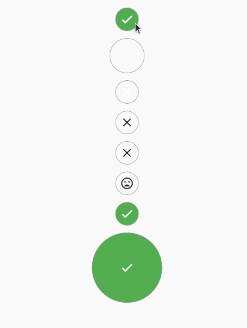

[](https://github.com/tenhobi/effective_dart)  
  
## Introduction  
Package created to give a fully functional and customizable round CheckBox.  
  
## Simple Usage  
The most simple use is this one. A prepared round checkbox that has a callback when selected/unselected.  
  
```dart  
RoundCheckBox(  
 onTap: (selected) {},),  
```  
  
That will generate this:  
  

  

## Customize to your needs  
You can customize all sort of behaviors and look you want. You can do things like setting selected/unselected color, selected/unselected  
widgets, duration of the animation, etc.  
  
The next example show some of the customizations.   
  
